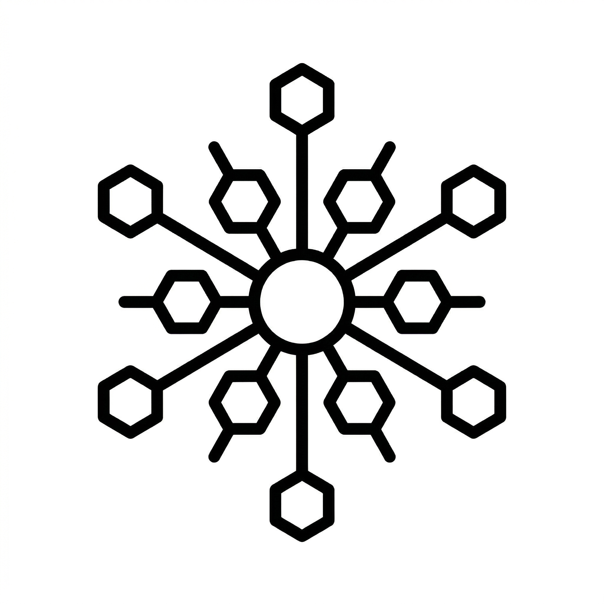

<p align="center">
  <a href="https://github.com/igris-labs/akaza-ui">
    
  </a>
</p>
<h1 align="center">
  Akaza UI
</h1>
<p align="center">
  <b>Vue-native headless UI primitives — accessible, unstyled, and built for Vue.</b>
  <br>
</p>

<p align="center">
  <a href="https://github.com/igris-labs/akaza-ui/stargazers">
    
  </a>
  <a href="https://github.com/igris-labs/akaza-ui/blob/main/LICENSE.md">
    
  </a>  
</p>

# Akaza UI

Unlike libraries ported from React (Radix, Reka), Akaza UI is designed from scratch for Vue 3. It uses `v-model`, named scoped slots, and the `ui` prop as first-class primitives — no sub-component trees, no `asChild`, no fighting the framework.

## Why Akaza UI?

| Others                                                                    | Akaza UI                                                        |
| ------------------------------------------------------------------------- | --------------------------------------------------------------- |
| `<DialogRoot><DialogTrigger><DialogPortal><DialogOverlay><DialogContent>` | `<Dialog v-model="isOpen">` with named slots                    |
| React-adapted DX                                                          | Vue-native: `v-model`, scoped slots, `inject/provide`           |
| Styled or opinionated defaults                                            | Fully unstyled — `data-akaza-*` attributes and class hooks only |

## Core Philosophy

- **Slot-based, not sub-component-based** — named scoped slots (`#trigger`, `#header`, `#body`, `#footer`) keep templates flat and readable
- **`v-model`-native** — all stateful components bind via standard `v-model`
- **`ui` prop for structural styling** — pass class strings per part (`ui.overlay`, `ui.content`, `ui.header`…) instead of wrapping sub-components
- **Items-based API for lists** — `RadioGroup`, `Menu`, `Tabs` accept an `items` array; per-item rendering uses named slots, not sub-components
- **Accessible by default** — WAI-ARIA roles, keyboard navigation, and focus management built in

## Components

| Component     | Description                                                                     |
| ------------- | ------------------------------------------------------------------------------- |
| `Button`      | Accessible button with `disabled`, `loading`, `focusableWhenDisabled`, and `as` |
| `Toggle`      | On/off button with `aria-pressed`                                               |
| `Switch`      | Binary toggle with WAI-ARIA switch role                                         |
| `Checkbox`    | Tri-state checkbox (`true`, `false`, `'indeterminate'`)                         |
| `RadioGroup`  | Accessible radio group with roving tabindex and custom item rendering           |
| `Progress`    | Progressbar with indeterminate support                                          |
| `Avatar`      | Image with fallback slot on load error                                          |
| `Separator`   | Horizontal or vertical divider, decorative or semantic                          |
| `Collapsible` | Single show/hide region with animated height                                    |
| `Accordion`   | Single or multi-open collapsible item list                                      |
| `Tooltip`     | Hover tooltip with auto-positioning and delay                                   |
| `Popover`     | Click-triggered floating panel with auto-positioning                            |
| `Dialog`      | Modal dialog with focus trap, Escape, backdrop                                  |
| `AlertDialog` | Confirmation dialog (no Escape/backdrop close per WAI-ARIA)                     |
| `Drawer`      | Side panel with slide-in animation (`top`, `right`, `bottom`, `left`)           |
| `Menu`        | Dropdown menu with items-based API, submenus, checkbox/radio items              |
| `Tabs`        | Accessible tab set with animated indicator, items-based API                     |

## Usage

### Dialog

```vue
<script setup lang="ts">
import { ref } from "vue";
import { Dialog } from "akaza-ui";

const isOpen = ref(false);
</script>

<template>
  <Dialog
    v-model="isOpen"
    :ui="{ overlay: 'my-overlay', content: 'my-dialog' }"
  >
    <template #trigger="{ toggle }">
      <button @click="toggle">Open</button>
    </template>

    <template #header="{ close, titleId }">
      <h2 :id="titleId">Confirm</h2>
      <button @click="close">✕</button>
    </template>

    <template #body="{ descriptionId }">
      <p :id="descriptionId">Are you sure you want to continue?</p>
    </template>

    <template #footer="{ close }">
      <button @click="close">Cancel</button>
      <button @click="close">Confirm</button>
    </template>
  </Dialog>
</template>
```

### Menu

```vue
<script setup lang="ts">
import { ref } from "vue";
import { Menu } from "akaza-ui";

const isOpen = ref(false);
const items = [
  { label: "Profile", onSelect: () => {} },
  { label: "Settings", onSelect: () => {} },
  { type: "separator" },
  { label: "Sign out", onSelect: () => {} },
];
</script>

<template>
  <Menu v-model="isOpen" :items="items">
    <template #trigger="{ toggle }">
      <button @click="toggle">Options</button>
    </template>
  </Menu>
</template>
```

### Tabs

```vue
<script setup lang="ts">
import { ref } from "vue";
import { Tabs } from "akaza-ui";

const activeTab = ref("overview");
const items = [
  { value: "overview", label: "Overview" },
  { value: "settings", label: "Settings" },
];
</script>

<template>
  <Tabs v-model="activeTab" :items="items" aria-label="Main navigation">
    <template #panel-overview>Overview content</template>
    <template #panel-settings>Settings content</template>
  </Tabs>
</template>
```

### useOverlay

Programmatically mount and open any overlay component (Dialog, Drawer, custom) without placing it in the template:

```vue
<script setup lang="ts">
import { useOverlay, OverlayProvider, Dialog } from "akaza-ui";

const overlay = useOverlay();
const confirmDialog = overlay.create(Dialog, {
  props: { ui: { content: "my-dialog" } },
  destroyOnClose: true,
});

async function handleDelete() {
  const { result } = confirmDialog.open();
  const confirmed = await result;
  if (confirmed) {
    /* proceed */
  }
}
</script>

<template>
  <OverlayProvider />
  <button @click="handleDelete">Delete</button>
</template>
```

### Tooltip

```vue
<Tooltip direction="top" :delay-duration="200">
  <template #trigger>
    <button>Hover me</button>
  </template>
  <template #content>
    Helpful information
  </template>
</Tooltip>
```

## Styling

Akaza UI is fully unstyled. Every structural element carries:

- **`data-akaza-state`** — current state (`open`, `closed`, `checked`, `disabled`, `loading`…)
- **`data-akaza-side`** — positioning side for floating elements (`top`, `bottom`, `left`, `right`)
- **`class="akaza-[component]-[part]"`** — semantic class for CSS targeting

Style via the `ui` prop (inject classes per structural part):

```vue
<Dialog :ui="{
  overlay: 'fixed inset-0 bg-black/50 backdrop-blur-sm',
  content: 'fixed top-1/2 left-1/2 -translate-x-1/2 -translate-y-1/2 bg-white rounded-xl shadow-xl w-full max-w-md',
  header: 'flex items-center justify-between p-6 border-b',
  body: 'p-6',
  footer: 'flex justify-end gap-2 p-6 border-t',
}">
```

Or target via CSS:

```css
[data-akaza-state="open"] { … }
.akaza-dialog-overlay { … }
.akaza-dialog-content { … }
```

## Requirements

- Vue `>=3.5.0`
- `@vueuse/core` (peer dependency, auto-installed)

## Installation

```sh
pnpm add akaza-ui
```

## Development

```sh
pnpm install
pnpm --filter playground dev   # playground with live source (no build needed)
```

The playground resolves `akaza-ui` directly from source via a Vite alias — no rebuild step required during development.

## Repo Structure

```
packages/
  akaza-ui/       — publishable library
    src/
      components/  — Vue component primitives
      composables/ — internal composables (useOverlay exported as public API)
      utils/       — focusTrap, focusable helpers
playground/       — interactive demo app (Tailwind v4 + Vue Router)
docs/             — future documentation site
```

## Status

Early development. API is not stable. Breaking changes may occur between minor versions.

## License

MIT
